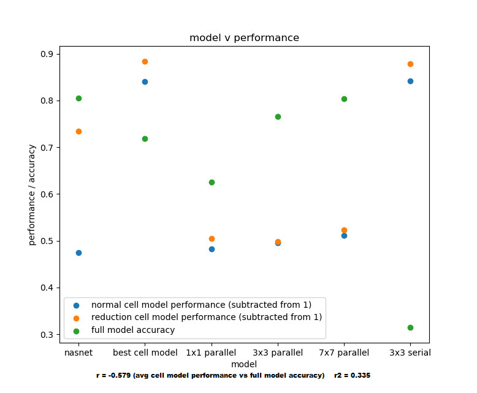

## NAS Experiements, Among Other Things

This repository contains a Tensorflow 2.1 implementation of a [NASNet](https://arxiv.org/abs/1707.07012)-like network, with the following properties beneficial to anyone experimenting with NAS:
- Mutation support, with inheritance of weights from parent for all non-mutated ops
- A detailed and object-oriented framework for interacting with every level of abstraction of components within the network (from model, to cell, to group/block, to operation)
- Saving and loading routines for models and model architectures, including an embedding scheme and serialization/deserialization of model hyperparameters and metrics
- A handful of model visualization and analysis tools

The project also contains a handful of sandboxes used for different experiments, including:
- Attempts at using static analysis of derivative cell properties to estimate cell performance. It hasn't worked so far.
- Attempts to evaluate cell architectures apart from the network macro-architecture. It didn't work, and here's a graphic with some results:

Go to town, fellow devs

### More details to come soon (maybe)